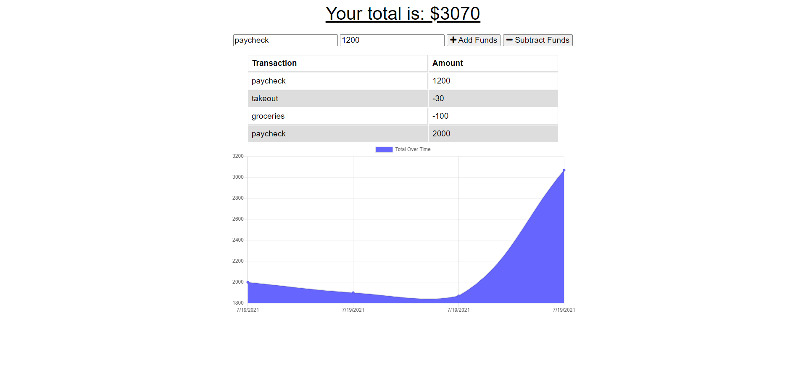
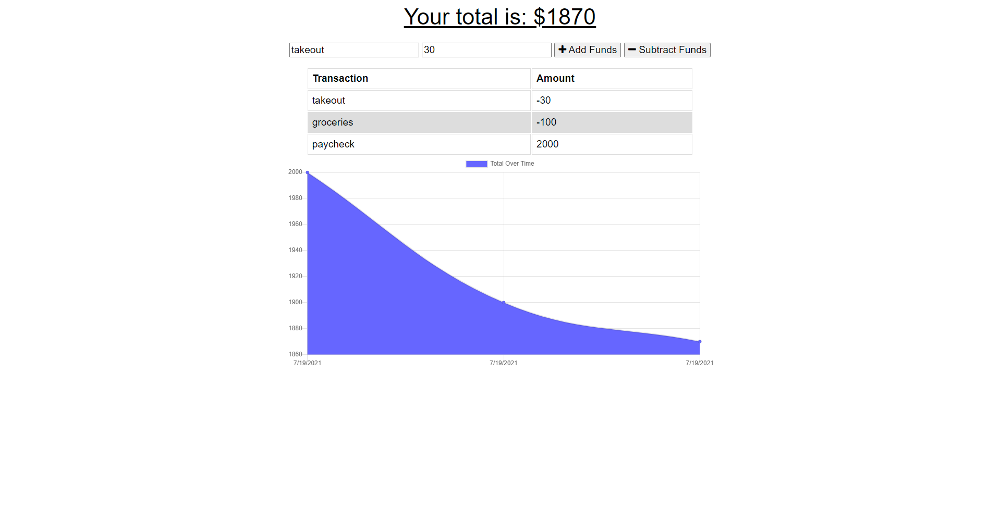

# PWA-Online-Offline-Budget-Trackers


[](https://spdx.org/licenses/MIT.html)
 ## Table of Contents
1. [Description](#description)

2. [Installation](#installation)

3. [Usage](#usage)

4. [Questions](#questions)

-----

## Description
The Budget-Tracker utilizes IndexedDB and MongoDB to create an application that runs both online and offline. This application provides a solution for any type of user! Whether you are traveling on a plane, train, or in a car and a stable internet connection isn't available, the Budget-Tracker continues to provide users the functionality and durability of tracking their expenses and transcations on the fly.
* When used Offline:
- The user can make deposits
- The user can enter their expenses
* When the App comes back Online:
- Entries made Offline should be added
 -----

 ## Installation
 

   Getting Started:
   
  
  

    npm install
    npm init --yes
    npm install mongoose
  


  


 ## Usage

 ---

 Run NoSQL/Mongoose Npm:
  * After installing and requiring our Npm packages we set up our connectiong to MongoDB
  ```

  mongoose.connect(process.env.MONGODB_URI || 'mongodb://localhost/   workout', {useNewUrlParser: true})
  .then(() => console.log('Connected to MongoDb!'))
  .catch(err => console.error('Erorr connecting to MongoDb', err));

 
    
   

 Start the Server:  
 
   node server.js 
```


Screenshots of Application:
--
Add funds to your Budget-Tracker: 



Fill out the details of your workout:




Visit the Repo: 
--
[Github]**<https://github.com/bdurham227/PWA-Online-Offline-Budget-Trackers>**

   


 ## License
 
[](https://spdx.org/licenses/MIT.html)

   https://opensource.org/licenses/MIT

    Licensed under the MIT License

    Copyright © [2021] [Benjamin Durham]
    

         Permission is hereby granted, free of charge, to any person obtaining a copy of this software and associated documentation files (the "Software"), to deal in the Software without restriction, including without limitation the rights to use, copy, modify, merge, publish, distribute, sublicense, and/or sell copies of the Software, and to permit persons to whom the Software is furnished to do so, subject to the following conditions:
        
        The above copyright notice and this permission notice shall be included in all copies or substantial portions of the Software.
        
        THE SOFTWARE IS PROVIDED "AS IS", WITHOUT WARRANTY OF ANY KIND, EXPRESS OR IMPLIED, INCLUDING BUT NOT LIMITED TO THE WARRANTIES OF MERCHANTABILITY, FITNESS FOR A PARTICULAR PURPOSE AND NONINFRINGEMENT. IN NO EVENT SHALL THE AUTHORS OR COPYRIGHT HOLDERS BE LIABLE FOR ANY CLAIM, DAMAGES OR OTHER LIABILITY, WHETHER IN AN ACTION OF CONTRACT, TORT OR OTHERWISE, ARISING FROM, OUT OF OR IN CONNECTION WITH THE SOFTWARE OR THE USE OR OTHER DEALINGS IN THE SOFTWARE


 ## Questions
 ---
 For additional questions about usage, installation or application improvement contact me through

Github: https://github.com/bdurham227

Email: bdurham227@gmail.com:

